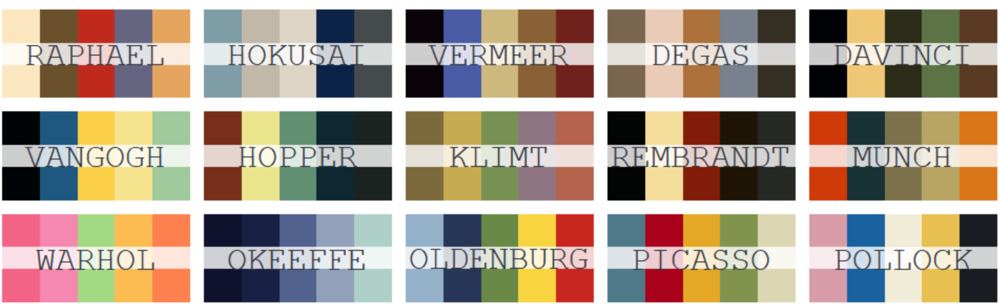
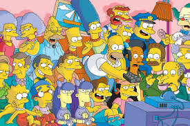

```{r meta, echo=FALSE, message=FALSE, warning=FALSE}
library(metathis)
meta() %>%
  meta_general(
    description = "An Introduction ggplot",
    generator = "xaringan and remark.js"
  ) %>% 
  meta_name("github-repo" = "eugene100hickey/ggplot-intro") %>% 
  meta_social(
    title = "Introduction to ggplot",
    url = "https://into-ggplot-nhsr.netlify.app",
    image = "https://github.com/eugene100hickey/blob/main/dawn.png",
    image_alt = "Front page for Introduction to ggplot",
    og_type = "website",
    og_author = "Eugene Hickey",
    twitter_card_type = "summary_large_image",
    twitter_creator = "@eugene100hickey"
  )
```


```{r setup, include = FALSE}
options(htmltools.dir.version = FALSE)
library(tidyverse)
library(scales)
library(gapminder)
library(ggrepel)
library(glue)
library(waffle)
library(treemapify)
library(ggridges)
library(lubridate)
library(boxoffice)
library(knitr)
library(xaringanExtra)
library(nhsrtheme)
library(NHSRdatasets)
library(flipbookr)
library(factoextra)
library(ggtext)
library(hrbrthemes)
library(HistData)
library(patchwork)
library(dslabs)
library(ggalt)
# set default options
opts_chunk$set(echo=FALSE,
               collapse = TRUE,
               # fig.width = 7.252,
               # fig.height = 4,
               dpi = 300,
               cache = TRUE,
               message = FALSE,
               warning = FALSE)

xaringanExtra::use_tile_view()
xaringanExtra::use_panelset()
xaringanExtra::use_clipboard()
xaringanExtra::use_webcam()
xaringanExtra::use_broadcast()
xaringanExtra::use_share_again()
xaringanExtra::style_share_again(
  share_buttons = c("twitter", "linkedin", "pocket")
)

```

```{r theme, cache = F}

my_colour = "firebrick4"
ggplot2::theme_set(ggplot2::theme_minimal())
ggplot2::theme_update(text = ggplot2::element_text(family = "Ink Free",
                                 size = 20,
                                 colour = my_colour),
             axis.text = ggplot2::element_text(colour = my_colour),
             rect = element_rect(colour = my_colour),
             line = element_line(colour = my_colour))
caption = "@DataVis_2020 Eugene"

my_ordinal_date <- function(dates){
     dayy <- day(dates)
     suff <- case_when(dayy %in% c(11,12,13) ~ "th",
                       dayy %% 10 == 1 ~ 'st',
                       dayy %% 10 == 2 ~ 'nd',
                       dayy %% 10 == 3 ~'rd',
                       TRUE ~ "th")
     paste0(dayy, suff)
 }

basketball <- read_csv("data/basketball.csv")
```

class: title-slide, right, top
background-image: url(img/dawn.png)
background-position: 90% 75%, 75% 75%
background-size:cover

.left-column[
# `r rmarkdown::metadata$title`
]

.right-column[
### `r rmarkdown::metadata$subtitle`

**`r rmarkdown::metadata$author`**<br>
`r rmarkdown::metadata$date`
]


.palegrey[.left[.footnote[Graphic by [Elaine Hickey](https://photos.google.com/photo/AF1QipMjKNoaxyne8nte4HmxA6Th9-4fUfSbl_mx-_1G)]]]

???

Welcome to the workshop on ggplot.

Where we'll show you how to create impressive data visualisations.

---

layout: true

<a class="footer-link" href="http://intro-ggplot-nhs.netlify.app">intro-ggplot-nhs &mdash; Eugene Hickey</a>

<!-- this adds the link footer to all slides, depends on footer-link class in css-->

---

# Choice of Colours in R
<br>

### We'll also discuss faceting.

- colours are very important
    - second only to position for perception
- can carry information
- also important to be visually pleasing
- worthwhile to make your figures aesthetically attractive
    - visualisations that are engaging are more effective

---

### Types of Colour Scales

.panelset[

```{r qsd_palette, echo = F, message = F, warning=F, fig.height=2}
knitr::opts_chunk$set(echo = TRUE, message = F, warning = F)

library(tidyverse)
library(RColorBrewer)
library(dslabs)
library(MASS)
library(viridis)
library(paletteer)

theme_set(
  theme_minimal() +
  theme(legend.title = element_blank(),
        text = element_text(family = "Ink Free", size = 16),
        panel.background = element_rect(fill = "#DDDDFF"))
)
```

.panel[
.panel-name[Qualitative]

.pull-left[

- suite of colours easily distinguished
- no heirarchy
- caters for visual impairments
]

.pull-right[

```{r qualitative_palette, echo = F, message = F, warning=F, fig.height=6}

display.brewer.pal(8, name = "Accent")

```

]
]<!-- close first panel -->

.panel[
.panel-name[Sequential]
.pull-left[

- band of colours, increasingly intense
- go from low to high

]

.pull-right[

```{r sequential_palette, echo = F, message = F, warning=F, fig.height=6}
display.brewer.pal(8, name = "BuGn")

```
]
]<!-- close second panel -->

.panel[
.panel-name[Diverging]
.pull-left[

- suite of colours from minus to plus
- contrasting colours at each end
- something neutral in the middle

]

.pull-right[

```{r diverging_palette, echo = F, message = F, warning=F, fig.height=6}
display.brewer.pal(8, name = "PRGn")
```

]
]<!-- close third panel -->
]<!-- close panelset -->

---

# Getting Colours in R
- some really great packages
    - <span style='color: #B03A2E'>RColorBrewer</span>
        - excellent, fine control over palette choice
    - <span style='color: #B03A2E'>viridis</span>
        - excels at palettes for vision-impaired readers
    - <span style='color: #B03A2E'>paletteer</span>
        - collection of palettes from various sources
    - <span style='color: #B03A2E'>wesanderson</span>
        - <i>names(wes_palettes)</i> followed
        by <i>wes_palette("BottleRocket1")</i>
    - <span style='color: #B03A2E'>rtist</span>
        - lifts principle colours from paintings
        
---

```{r rtist, echo = T, eval = F}
library(rtist)
par(mfrow = c(3, 5))
map(names(rtist_palettes), function(x) print(rtist_palette(x)))
```



---

- more....
    - tvthemes()
        - not just colours, but layouts and fonts
        - everything from Game of Thrones to Spongebob (yes, really)
    - ggsci(), palettes for scientific publications (Lancet, AAAS, etc)
    - colorspace()
        - resources for picking colours
        - choose_color() and choose_palette()
        - can convert colours based on vision deficiencies
        - will convert from colour descriptions, e.g. hex2RGB()
- and a [cheatsheet](https://www.nceas.ucsb.edu/~frazier/RSpatialGuides/colorPaletteCheatsheet.pdf)

---

```{r palette-quiz, echo=FALSE}
xaringanExtra::embed_xaringan(url = "https://eugene-hickey.shinyapps.io/01-colours/", ratio = "16:9")
```


---

## Ways of Describing Colours

- by name: "red", "cyan", "violetred4", "thistle".....
    - get full list of 657 available in R from _colors()_
- by hex code: "#f49340", "#40f9f9", "#ee82ef", "#d8bfd1".... (see [htmlcolors](https://htmlcolorcodes.com/)])
- by rgb values: (249, 67, 64), (64, 249, 249), (57, 14, 30), (216, 191, 209)....
  - note, rgb() function takes these as a fraction from 0-1
- by hcl values: (53.24, 179.04, 12.17), (91.11, 72.10, 192.17), (32.36, 63.11, 349.86), (80.08, 20.79, 307.73)....

---

# Investigating Colours in R

- the following code shows the first "N" colours in R where N is set to 10 here:

.pull-left[

```{r base-colours, echo = T, eval = F, message = F, warning = F, fig.height=3}
N <- 10
data.frame(col = colors()[1:N]) %>%
  ggplot(aes(x = col, fill = col)) +
  geom_bar(position = "stack",
           show.legend = F) +
  coord_flip() +
  theme_minimal() +
  theme(axis.text.x = element_blank(),
        axis.title.x = element_blank(),
        axis.text.y = element_blank())
```

]

.pull-right[

```{r base-colours-out, ref.label="base-colours", echo=FALSE}
```

]

---

## Other Usful Functions

- _show_col()_ from the _scales_ package is super useful
    - e.g. show_col("red") or show_col("#84a412")
- *rgb()* will give a hex code for a fraction of red, green, blue
    - e.g. rgb(0.4, 0.2, 0.5) gives "#663380"

---

- *colourPicker()* from the colourpicker package
    - colourPicker(numCols = 4), opens up shiny app, returns colours
- *col2rgb()*, also *col2hex()* from the _gplots_ (not _ggplot2_) package, and *col2hcl* from the _jmw86069/jamba_ package
    - this last is on github, so you must install the package _devtools_ then do _install_github( jmw86069/jamba)_

- _colorfindr_ takes an image and identifies major colours

---

.pull-left[



```{r simpsons, eval=F, fig.height=3}
(colors <- colorfindr::get_colors("img/simpsons.jpeg",
                                  top_n = 6,
                                  exclude_col = "#FFFFFF"))
scales::show_col(colors$col_hex, ncol = 6)
```

]

.pull-right[
```{r simpsons-out, ref.label="simpsons", echo=FALSE}
```
]

---

# Some Websites and Tools

- [coolors.co](coolors.co)
    - will generate appropriate palettes
- [colorpicker](http://tristen.ca/hcl-picker/#/hlc/6/1.1/8C4443/845128)
- [colorspace](http://colorspace.r-forge.r-project.org/articles/hcl_palettes.html#qualitative-palettes)
- Chrome has an _**Eye Dropper**_ tool
    - click on part of a webpage and it will tell you the colour
- Nice description of colurs from [Stowers](https://www.uv.es/conesa/CursoR/material/UsingColorInR.pdf)

---

# Colours in _ggplot()_

- use for _fill_ and for _col_ aesthetics
- add the _scale_fill_... and _scale_color_... layers to control
- explore these by typing _?scale_fill_ and then TAB to see the range of options

---

`r chunk_reveal("my_rotate", break_type = "rotate", widths = c(60,40))`

```{r my_rotate, eval = F, echo = F}
dslabs::gapminder %>%
  group_by(continent, year) %>%
  summarise(average_fertility =
              mean(fertility, na.rm = TRUE)) %>%
  ungroup() %>%
  ggplot(aes(x = year,
             y = average_fertility,
             col = continent)) +
  geom_line(size = 2) + 
  scale_color_brewer(type = 'qual') + #ROTATE
  scale_color_brewer(type = 'div') + #ROTATE
  scale_color_viridis_d(option = 'magma') + #ROTATE
  scale_color_paletteer_d('rtist::warhol') + #ROTATE
  scale_color_paletteer_d('MapPalettes::irish_flag') + #ROTATE
  scale_color_paletteer_d('yarrr::southpark') + #ROTATE
  scale_color_paletteer_d('dutchmasters::pearl_earring') + #ROTATE
  scale_color_paletteer_d('dutchmasters::view_of_Delft') + #ROTATE
  scale_color_paletteer_d('ghibli::KikiLight') + #ROTATE
  scale_color_paletteer_d('LaCroixColoR::Coconut') + #ROTATE
  scale_color_paletteer_d('LaCroixColoR::PassionFruit') + #ROTATE
  scale_color_paletteer_d('ggsci::lanonc_lancet') + #ROTATE
  scale_color_paletteer_d('ggsci::default_uchicago') + #ROTATE
  scale_color_paletteer_d('ggsci::uniform_startrek') #ROTATE
```

---


```{r histogram-colours, eval = F, echo = F}
dslabs::gapminder %>% 
  ggplot(aes(x = life_expectancy,
             fill = ..x..)) +
  geom_histogram() +
  scale_fill_continuous(type = 'viridis') + #BREAK
  scale_fill_gradient2(low = "darkgreen", 
                       mid = "white",
                       high = "firebrick4", 
                       midpoint = 65)  #BREAK
```

`r chunk_reveal("histogram-colours", break_type = "user", widths = c(50,50))`

---


class: center, inverse

# _faceting_

- Faceting means producing multiple panels of a plot
- Splits a plot into several versions based on a categorical variable
- functions _facet_wrap()_ and _facet_grid()_
- useful when lots of data in different subsets
- important to keep axis scales the same

---

`r chunk_reveal("facet-example1")`

```{r facet-example1, eval = FALSE, echo = F, message=F, warning=F}
sex <- c("Female", "Male")
names(sex) <- c("F", "M")
cats %>%     ### cats dataset from MASS
  ggplot(aes(Bwt, Hwt)) +
  geom_point() +
  geom_smooth(aes(col = Sex), show.legend = F, se = F) +
  facet_grid(~Sex, labeller = labeller(Sex = sex)) +
  labs(x = "Bodyweight (kg)", y = "Heart Weight (g)") +
  theme_minimal() +
  theme(strip.background = element_blank(), 
        text = element_text(size = 32,
                            family = "Ink Free"))
```

---

`r chunk_reveal("facet-example2", break_type = "user")`

```{r facet-example2, eval = F, message = F, warning = F, echo = F}
movielens %>%      ### movielens dataset from dslabs
  mutate(genres = str_replace(genres, pattern = "\\|.*", "")) %>%
  filter(genres != "(no genres listed)") %>%
  ggplot(aes(rating)) +
  stat_density(position = "identity", geom = "line", adjust = 3) + #BREAK
  facet_wrap(.~genres, strip.position = "bottom", nrow = 3) + #BREAK 
  theme(axis.text.y = element_blank(), 
        axis.title.y = element_blank(), 
        axis.text.x = element_blank(),
        axis.title.x = element_blank()) #BREAK
```

---

`r chunk_reveal("facet-example3", break_type = "user", widths = c(60,40))`

```{r facet-example3, eval = F, message = F, echo = F, warning = F}
## snails dataset from the MASS library 
snails %>% #BREAK
  ggplot(aes(Exposure, Deaths, col = factor(Rel.Hum))) +
  geom_line() + 
  geom_point() + 
  theme(legend.title = element_blank()) +  #BREAK
  facet_grid(Species ~ Temp, 
             scales = "free")  #BREAK
```


