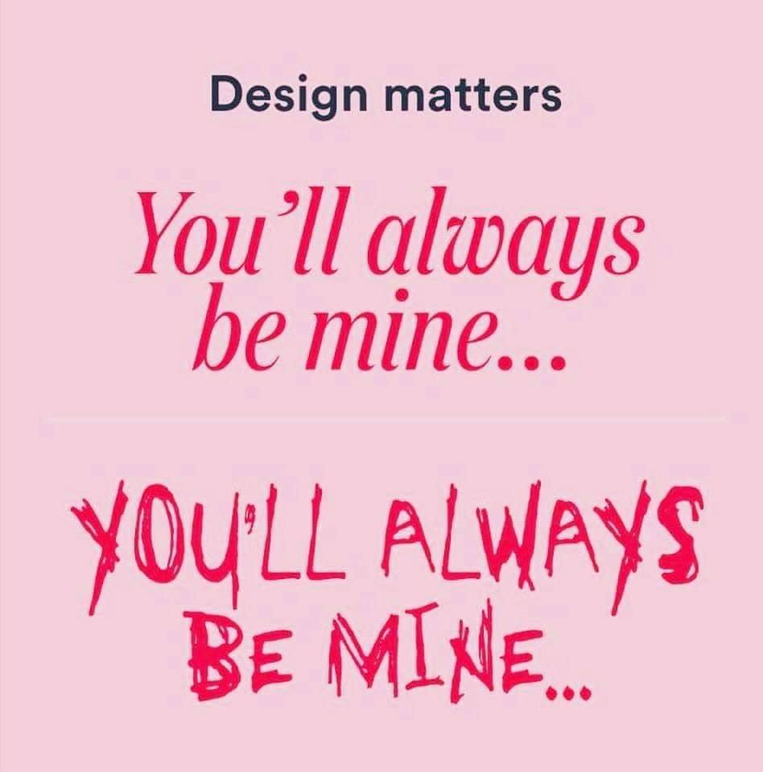
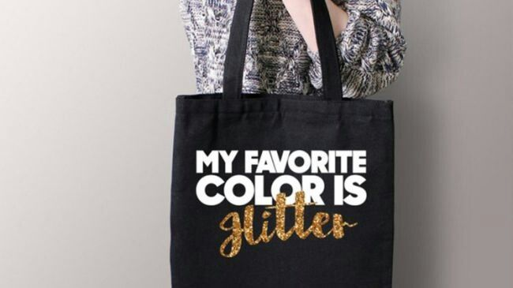
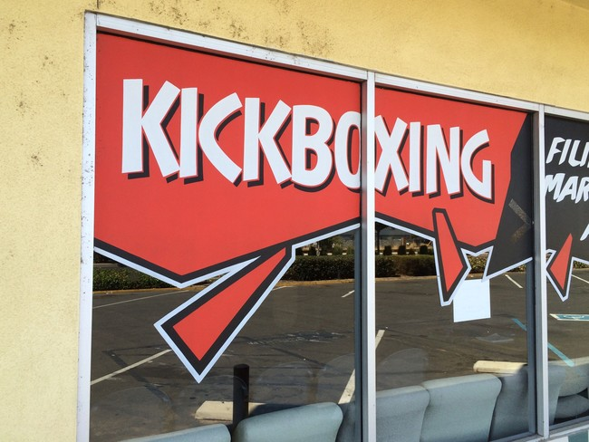

```{r meta, echo=FALSE, message=FALSE, warning=FALSE}
library(metathis)
meta() %>%
  meta_general(
    description = "An Introduction ggplot",
    generator = "xaringan and remark.js"
  ) %>% 
  meta_name("github-repo" = "eugene100hickey/ggplot-intro") %>% 
  meta_social(
    title = "Introduction to ggplot",
    url = "https://into-ggplot-nhsr.netlify.app",
    image = "https://github.com/eugene100hickey/blob/main/fog.png",
    image_alt = "Front page for Introduction to ggplot",
    og_type = "website",
    og_author = "Eugene Hickey",
    twitter_card_type = "summary_large_image",
    twitter_creator = "@eugene100hickey"
  )
```


```{r setup, include = FALSE}
options(htmltools.dir.version = FALSE)
library(tidyverse)
library(scales)
library(gapminder)
library(ggrepel)
library(glue)
library(waffle)
library(treemapify)
library(ggridges)
library(lubridate)
library(boxoffice)
library(knitr)
library(xaringanExtra)
library(nhsrtheme)
library(NHSRdatasets)
library(flipbookr)
library(factoextra)
library(ggtext)
library(hrbrthemes)
library(HistData)
library(patchwork)
library(dslabs)
library(ggalt)
# set default options
opts_chunk$set(echo=FALSE,
               collapse = TRUE,
               # fig.width = 7.252,
               # fig.height = 4,
               dpi = 300,
               cache = TRUE,
               message = FALSE,
               warning = FALSE)

xaringanExtra::use_tile_view()
xaringanExtra::use_panelset()
xaringanExtra::use_clipboard()
xaringanExtra::use_webcam()
xaringanExtra::use_broadcast()
xaringanExtra::use_share_again()
xaringanExtra::style_share_again(
  share_buttons = c("twitter", "linkedin", "pocket")
)

```

class: title-slide, right, top
background-image: url(img/fog.png)
background-position: 90% 75%, 75% 75%
background-size:cover

.left-column[
# `r rmarkdown::metadata$title`
]

.right-column[
### `r rmarkdown::metadata$subtitle`

**`r rmarkdown::metadata$author`**<br>
`r rmarkdown::metadata$date`
]


.palegrey[.left[.footnote[Graphic by [Elaine Hickey](https://photos.google.com/photo/AF1QipMjKNoaxyne8nte4HmxA6Th9-4fUfSbl_mx-_1G)]]]

???

Welcome to the workshop on ggplot.

Where we'll show you how to create impressive data visualisations.

---

layout: true

<a class="footer-link" href="http://intro-ggplot-nhs.netlify.app">intro-ggplot-nhs &mdash; Eugene Hickey</a>

<!-- this adds the link footer to all slides, depends on footer-link class in css-->

---

class: center, inverse

# <p style="font-family:'Cabin Sketch'">Using Themes in R</p>
<br>

### We'll also discuss fonts (first) and scales.

- themes give fine control to the appearance of your plots
    - control over text size, fonts, text colour, etc
    - position of legends, titles, captions, etc
    - colours of backgrounds
    - delete unwanted features (like, say, tick marks on an axis)
    
---

class: center, inverse


- large number of preset themes
- several packages with neat bundle of useful themes
    - we'll discuss some of these later
- and, of course, we can develop our own theme to have consistent graphics

---

## Fonts

- we'll discuss this first, as often themes require fonts which might not be present
- fonts are a whole world of their own
- see [practicaltypography.com](practicaltypography.com)
- great talk by [Will Chase](https://rstudio.com/resources/rstudioconf-2020/the-glamour-of-graphics/) at RStudioConf2020

---

```{r, echo=FALSE, out.width="50%"}

```


---


---


---




---

- need to add fonts before we can use them
- simplest way is using *font_add_google* from the [showtext](https://github.com/yixuan/showtext) package

.pull-left[

```{r font_add_google, echo = T, message = FALSE, warning = FALSE, eval=FALSE}
library(showtext)
font_add_google(name = "Covered By Your Grace", 
                family = "grace")
showtext_auto()
msleep %>% ggplot(aes(x = bodywt, 
                      y = brainwt, 
                      colour = order)) + 
  geom_point(show.legend = F) + 
  scale_x_log10(labels = scales::label_comma()) + 
  scale_y_log10(labels = scales::label_comma()) + 
  labs(title = "Bigger Animals have Bigger Brains") +
  theme(text = element_text(size = 40, family = "grace"))
```
]

.pull-right[
```{r font_add_google-out, ref.label="font_add_google", echo=FALSE}
```
]

---

- what if we want more than just the google fonts
- download font from the web (need *.ttf* file)
    - see [fonts.google.com](https://fonts.google.com/)
    - or [fontsquirrel.com](https://www.fontsquirrel.com/)
    - or [1001freefonts.com](https://www.1001freefonts.com/)
- use *showtext::font_add(family = "some neat font name", regular = "path/to/downloaded.ttf")* where we give the directory where we downloaded the .ttf file
- again, need *showtext_auto()* to make them live

---

- above processes have to be carried out every time we run R
- can make them permanently available too
- need to be in the system, load them into windows / mac / linux
    - only really works for true type fonts (.ttf)
    - go to folder where the R library lives and seek out fonts
        - type **.libPaths()** to find out where
    - e.g. R/x86_64-pc/3.6/tvthemes/fonts/SpongeBob
    - click on .ttf files to install
- then need to capture them  in R
    - install package *extrafont*
    - run *ttf_import()* with path = folder from above
    - run *View(fonttable())* to check available fonts
    - usually need to restart R (*Session* then *Restart R*)
    
---

## Complete Themes
- these set up ggplots with standard appearances
- can always adjust these, but do so in a layer after invoking the theme
- some defaults in ggplot2, see [here](https://ggplot2.tidyverse.org/reference/ggtheme.html)
- you should experiment with these to see how they look

---

`r chunk_reveal("themes1", break_type = "rotate", widths = c(50,50))`

```{r themes1, eval = F, echo = F, include = T}
palmerpenguins::penguins %>% ggplot(aes(body_mass_g, flipper_length_mm, col = island)) +
  geom_point() +
  theme_classic() + #ROTATE
  theme_dark() + #ROTATE
  theme_excel() + #ROTATE
  theme_economist() + #ROTATE
  theme_fivethirtyeight() + #ROTATE
  theme_wsj()#ROTATE
  
```

---

## Complete Themes

- other package provide supplementary themes
    - *ggthemes*
    - *ggthemr* (see [here](https://github.com/cttobin/ggthemr))
    - *tvthemes* (see [here](https://ryo-n7.github.io/2019-05-16-introducing-tvthemes-package/))
    - *hrbrthemes* see [here](https://github.com/hrbrmstr/hrbrthemes)
    - *firatheme* (see [here](https://github.com/vankesteren/firatheme))
    - *bbplot*, themes from the BBC (see [here](https://github.com/bbc/bbplot))
    - *ggtech* themes from companies, e.g. Facebook. See [here](https://github.com/ricardo-bion/ggtech)
- [This website](https://rfortherestofus.com/2019/08/themes-to-improve-your-ggplot-figures/) is pretty good on themes
- again, make sure you experiment with these

---

## Fine Control Over Themes

- we can change any feature of a theme that we want
- type *?theme* on the console to see available themes
    - there are a lot of themes
- use *element_&&&&&* to replace theme
- example: *theme(text = element_text(family = "Roboto Sans"))*

---


```{r themes3, fig.height=6, fig.width=9, message=F, warning=F}
palmerpenguins::penguins %>% ggplot(aes(body_mass_g, flipper_length_mm, col = island)) + 
  geom_point() +
  theme(text = element_text(family = "Cabin Sketch", 
                            size = 40, 
                            face = "bold"))
```

---

```{r themes4, fig.height=6, fig.width=9, message=F, warning=F}
palmerpenguins::penguins %>% ggplot(aes(body_mass_g, flipper_length_mm, col = island)) +
  geom_point() +
  theme(legend.position = "bottom", axis.text.y = element_blank())
```


---

- **theme_set()** and **theme_get()** pretty useful

```{r themes5, fig.height=6, fig.width=9, message=F, warning=F}
theme_set(theme(text = element_text(family = "Fiendish", colour = "#691740", face = "bold")))

palmerpenguins::penguins %>% ggplot(aes(body_mass_g, flipper_length_mm, col = island)) +
  geom_point()
```


---

```{r teeth, message=F, warning=F, fig.height=4}
theme_bluewhite <- function (base_size = 11, base_family = "Get Schwifty") {
    theme_bw() %+replace% 
    theme( text = element_text(size = base_size, family = base_family),
      panel.grid.major  = element_line(color = "white"),
      panel.background = element_rect(fill = "lightblue"),
      panel.border = element_rect(color = "lightblue", fill = NA),
      axis.line = element_line(color = "lightblue"),
      axis.ticks = element_line(color = "lightblue"),
      axis.text = element_text(color = "steelblue")
      )
}
ggplot(ToothGrowth, aes(factor(dose), len)) + # Using our new theme
  geom_boxplot() +
  theme_bluewhite(base_size = 24)
```

---


class: center, inverse

# _scales_

- I like the scales package and feel it's worth discussing
- We used it to give dollar signs in the last assignment
- (also, has the _show_col()_ function)
- can be used to change to scientific notation, or not
- utilities like _comma()_, _dollar()_, _label_number_si()_, _percent()_, _pretty_breaks()_
- [this is a nice overview](https://bookdown.org/Maxine/ggplot2-maps/posts/2019-11-27-using-scales-package-to-modify-ggplot2-scale/)

---

```{r gapminder_plot, fig.width=10, fig.height=6}
gapminder::gapminder %>% filter(continent == "Americas") %>% ggplot(aes(gdpPercap, pop)) + 
  geom_line(aes(col = country), show.legend = F) + 
  scale_y_log10(labels = label_number_si(unit = " people")) +
  scale_x_log10(labels = dollar) + theme(text = element_text(size = 16), axis.title.y = element_blank())
```

---
