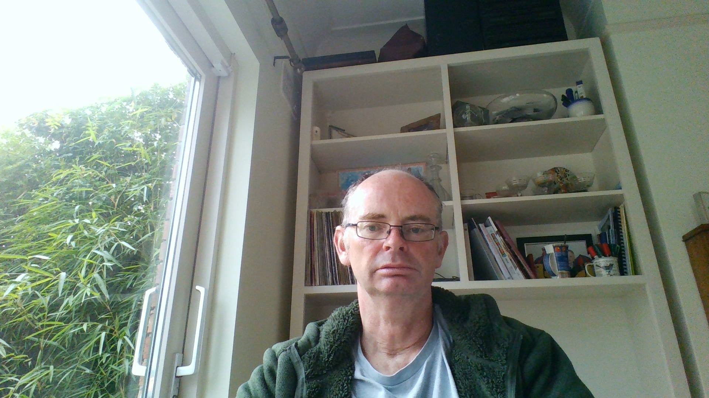

```{r meta, echo=FALSE, message=FALSE, warning=FALSE}
library(metathis)
meta() %>%
  meta_general(
    description = "An Introduction ggplot",
    generator = "xaringan and remark.js"
  ) %>% 
  meta_name("github-repo" = "eugene100hickey/ggplot-intro") %>% 
  meta_social(
    title = "Introduction to ggplot",
    url = "https://into-ggplot-nhsr.netlify.app",
    image = "https://github.com/eugene100hickey/blob/main/moon.png",
    image_alt = "Front page for Introduction to ggplot",
    og_type = "website",
    og_author = "Eugene Hickey",
    twitter_card_type = "summary_large_image",
    twitter_creator = "@eugene100hickey"
  )
```


```{r setup, include = FALSE}
options(htmltools.dir.version = FALSE)
library(knitr)
library(tidyverse)
library(xaringanExtra)
library(nhsrtheme)
library(NHSRdatasets)
library(flipbookr)
library(factoextra)
# set default options
opts_chunk$set(echo=FALSE,
               collapse = TRUE,
               fig.width = 7.252,
               fig.height = 4,
               dpi = 300,
               cache = TRUE,
               message = FALSE,
               warning = FALSE)

xaringanExtra::use_tile_view()
xaringanExtra::use_panelset()
xaringanExtra::use_clipboard()
xaringanExtra::use_webcam()
xaringanExtra::use_broadcast()
xaringanExtra::use_share_again()
xaringanExtra::style_share_again(
  share_buttons = c("twitter", "linkedin", "pocket")
)

```


class: title-slide, right, top
background-image: url(img/dawn.JPG)
background-position: 90% 75%, 75% 75%
background-size:cover

.left-column[
# `r rmarkdown::metadata$title`
] 

.right-column[
### `r rmarkdown::metadata$subtitle`

**`r rmarkdown::metadata$author`**<br>
`r rmarkdown::metadata$date`
]


.palegrey[.left[.footnote[Graphic by [Elaine Hickey](https://photos.google.com/photo/AF1QipMjKNoaxyne8nte4HmxA6Th9-4fUfSbl_mx-_1G)]]]

???

Welcome to the workshop on ggplot.

Where we'll show you how to create impressive data visualisations.

---
name: about-me
layout: false
class: about-me-slide, inverse, middle, center

# About me



## Eugene Hickey

### lecturer in physics

.fade[Technological University<br>Dublin]

[`r icon::fa("link")` bioscience.netlify.app](https://bioscience.netlify.app)
[`r icon::fa("twitter")` @eugene100hickey](https://twitter.com/eugene100hickey)
[`r icon::fa("github", size = 1)` eugene100hickey](https://github.com/eugene100hickey)

---
layout: true

<a class="footer-link" href="http://intro-ggplot-nhs.netlify.app">intro-ggplot-nhs &mdash; Eugene Hickey</a>

<!-- this adds the link footer to all slides, depends on footer-link class in css-->

---
class: top

# Acknowledgments

.pull-left-narrow[.center[]]

.pull-right-wide[
[Sharon Townsend](https://www.strategyunitwm.nhs.uk/author/sharon-townsend), co-pilot for this workshop and business manager at the NHS, Midlands and Lancashire Strategy Unit.
]

--

.pull-left-narrow[.center[
]]

.pull-right-wide[
[NHS-R Community](https://nhsrcommunity.com/) for the opportunity to provide this workshop
- [NHSRdatasets `r emo::ji("package")`](https://github.com/nhs-r-community/NHSRdatasets) developed by Chris Mainey and Tom Jemmett
]

--

.pull-left-narrow[.center[
`r icon::fa("smile", size = 3, color = "#e5bf00")`]]

.pull-right-wide[
- [xaringan `r emo::ji("package")`](https://github.com/yihui/xaringan#xaringan) developed by Yihui Xie
- [flipbookr `r emo::ji("package")`](https://github.com/EvaMaeRey/flipbookr) developed by Gina Reynolds
- [learnr `r emo::ji("package")`](https://github.com/rstudio/learnr) developed by Garrick Aden-Buie
]


---
class: goodbye-slide, inverse, left

.pull-left[
.middle[

# Thank you!

### Here's where you can find me...

.right[
[silvia.rbind.io `r icon::fa("link")`](https://silvia.rbind.io)<br/>
[@spcanelon `r icon::fa("twitter")`](https://twitter.com/spcanelon)<br/>
[@spcanelon `r icon::fa("github")`](https://github.com/spcanelon)<br/>
]]]
